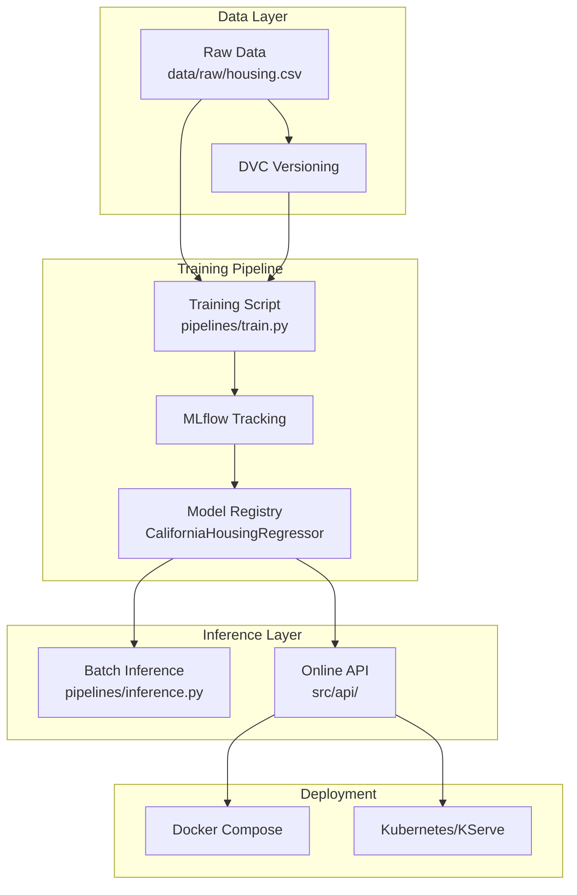

# 🚀 ML from Scratch to Production

<div align="center">

[](https://www.python.org/)
[](https://scikit-learn.org/)
[](https://dvc.org/)
[](https://mlflow.org/)
[](https://fastapi.tiangolo.com/)
[](https://www.docker.com/)
[](https://kubernetes.io/)
[](https://opensource.org/licenses/MIT)

**An end-to-end Machine Learning engineering project that demonstrates how an ML system evolves from experimentation into a production-ready, containerized, and deployable service.**

</div>


## 🎯 Project Overview

This repository demonstrates the **full lifecycle of a Machine Learning system**, from early experimentation to production-oriented deployment.

Using the **California Housing dataset**, the project focuses on **engineering practices**:

- Reproducible training pipelines
- Explicit separation between training and serving
- Model lifecycle management with MLflow
- Batch and online inference workflows
- Docker-first execution
- Kubernetes-ready architecture


## 🌿 Branch Architecture

This repository is structured as a **progressive learning path**, with each branch representing a stage in ML system maturity.

| Branch | Focus | Key Question |
|------|------|-------------|
| `ml-baseline` | ML experimentation | *How do we explore data and choose a model?* |
| `api-baseline` | Serving fundamentals | *How do we expose a trained model?* |
| `main` | Production MLOps | *How does this become reliable and deployable?* |

The `main` branch represents the **final, production-oriented design**.


## 🏗️ System Architecture Overview




## 🚀 Quick Start (Main Branch)

```bash
git clone https://github.com/atkaridarshan04/ml-from-scratch-to-prod.git
cd ml-from-scratch-to-prod
git checkout main
```

The recommended way to run the system locally is **Docker**.

➡️ See: [docs/environments/docker.md](./docs/environments/docker.md)


## 🗂️ Project Structure (Main)

```
ml-from-scratch-to-prod/
├── .dvc/                 # DVC configuration
├── data/                 # Raw data and inference inputs
├── docs/                 # Architecture, workflows, and decisions
├── pipelines/            # Training & batch inference entry points
├── src/                  # Core ML logic and API implementation
├── tests/                # API tests
├── Dockerfile.api        # Inference API image
├── Dockerfile.train      # Training image
├── docker-compose.yml    # Local orchestration
├── requirements/         # Dependency separation (train / api)
└── README.md             # This file
```


## 📚 Documentation Hub

All documentation lives under `docs/` and is organized by **concern**.

| Area            | Description                                   |
| --------------- | --------------------------------------------- |        
| [codebase/](./docs/codebase/)     | Source code organization and design decisions |
| [workflows/](./docs/workflows/)    | Training and inference pipelines              |
| [environments/](./docs/environments/) | Local, Docker, and Kubernetes execution       |
| [mlflow/](./docs/mlflow/)       | Experiment tracking and model lifecycle       |        

Start here:

➡️ [docs/README.md](./docs/README.md)


## 🧪 Testing

```bash
pytest -v
```

## 📄 License

This project is licensed under the MIT License.
See the [LICENSE](LICENSE) file for details.

---