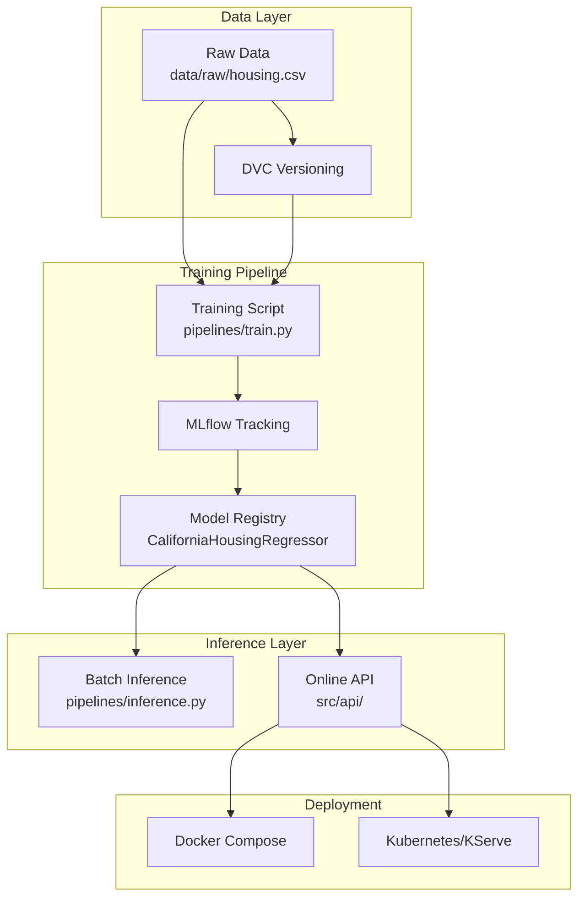

# 📚 Documentation Hub

This directory contains comprehensive documentation for the **ML from Scratch to Production** project. The documentation is organized by concern to help you navigate the system effectively.

## 🎯 Quick Navigation

| **I want to...** | **Go to** |
|-------------------|-----------|
| Understand the codebase structure | [📁 Codebase Documentation](#-codebase-documentation) |
| Run the project locally or with Docker | [🌍 Environment Setup](#-environment-setup) |
| Learn about training and inference workflows | [⚙️ Workflow Documentation](#️-workflow-documentation) |
| Understand MLflow integration | [📊 MLflow Documentation](#-mlflow-documentation) |
| Set up data versioning | [📦 Data Management](#-data-management) |

## 📁 Codebase Documentation

Understanding the source code organization and design decisions.

| Document | Purpose |
|----------|---------|
| [**src-overview.md**](./codebase/src-overview.md) | High-level source code structure and design principles |
| [**api-design.md**](./codebase/api-design.md) | FastAPI service architecture and model loading strategy |
| [**model-packaging.md**](./codebase/model-packaging.md) | Unified model artifact strategy and training-serving consistency |

**Key Concepts:**
- Clear separation between training and serving logic
- Unified model artifacts to prevent training-serving skew
- FastAPI application state for model management

## 🌍 Environment Setup

Choose your preferred development and deployment environment.

| Environment | Document | Best For |
|-------------|----------|----------|
| **🐳 Docker** | [**docker.md**](./environments/docker.md) | Production-like local development, CI/CD |
| **🧪 Local** | [**local.md**](./environments/local.md) | Development, debugging, experimentation |
| **☸️ Kubernetes** | [**k8s.md**](./environments/k8s.md) | KServe demonstration, cloud deployment |

**Recommended Path:** Start with Docker for the complete experience, then use local development for iteration.

## ⚙️ Workflow Documentation

Understanding the ML system workflows and pipelines.

| Workflow | Document | Purpose |
|----------|----------|---------|
| **🏋️ Training** | [**training.md**](./workflows/training.md) | Model training, evaluation, and registration |
| **📦 Batch Inference** | [**inference-batch.md**](./workflows/inference-batch.md) | Offline prediction workflows |
| **🌐 Online Inference** | [**inference-online.md**](./workflows/inference-online.md) | Real-time API serving and request handling |

**Key Design:** All workflows use the same unified model artifact from MLflow, ensuring consistency across training and inference.

## 📊 MLflow Documentation

MLflow serves as the central system for experiment tracking and model lifecycle management.

| Aspect | Document | Focus |
|--------|----------|-------|
| **🧪 Experiment Tracking** | [**tracking.md**](./mlflow/tracking.md) | Logging runs, parameters, metrics, and artifacts |
| **📋 Model Registry** | [**model-registry.md**](./mlflow/model-registry.md) | Model versioning, aliases, and promotion strategy |

**Core Principle:** MLflow acts as the contract between training and inference, providing a single source of truth for model artifacts.

## 📦 Data Management

Data versioning and reproducibility using DVC.

| Document | Purpose |
|----------|---------|
| [**dvc.md**](./dvc.md) | Data Version Control setup, strategy, and workflows |

**Strategy:** DVC tracks only the raw dataset, while all derived artifacts are generated deterministically by pipelines.

## 🏗️ System Architecture Overview

## 🚀 Getting Started

1. **Choose your environment:** Start with [Docker setup](./environments/docker.md) for the complete experience
2. **Understand the codebase:** Read the [source overview](./codebase/src-overview.md)
3. **Run training:** Follow the training workflow in your chosen environment
4. **Explore MLflow:** Check the [tracking documentation](./mlflow/tracking.md)
5. **Try inference:** Test both batch and online inference workflows

---
