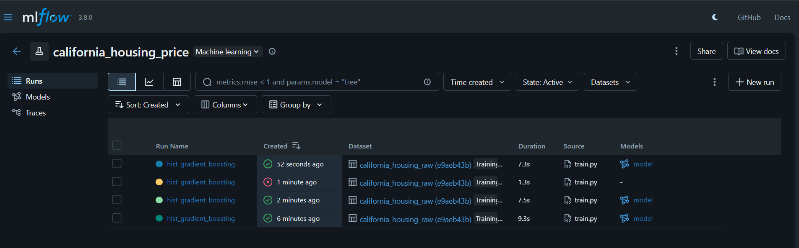
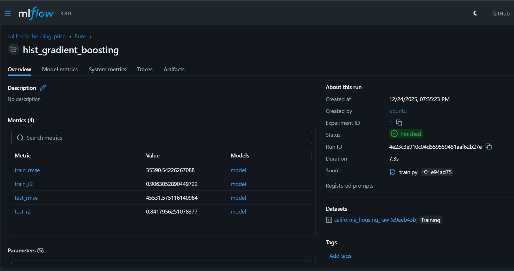

# 📈 Experiment Tracking & Model Registry with MLflow

This project uses **MLflow** to track machine learning experiments and store
trained models as part of a **production-oriented ML workflow**.

At the current stage, MLflow is primarily used to:
- Track experiments during training
- Store trained models and preprocessing artifacts
- Provide a single place to inspect runs, metrics, and artifacts

This setup is intentionally **simple and local-first** to demonstrate MLflow
usage clearly. The workflow will evolve further as CI/CD and deployment are
introduced.


## 🧠 MLflow Scope in This Project

### MLflow is used for:

- Experiment tracking (parameters and metrics)
- Persisting trained models
- Persisting preprocessing artifacts
- Model version history (via the Model Registry)

## ⚙️ MLflow Setup

### 1️⃣ Install MLflow

```bash
pip install mlflow
````

---

### 2️⃣ Start the MLflow Tracking Server

From the project root:

```bash
mlflow server \
  --host 127.0.0.1 \
  --port 5000 \
  --backend-store-uri sqlite:///mlflow.db \
  --default-artifact-root "$(pwd)/mlruns"
```

This starts a **local MLflow tracking server** backed by SQLite.

The MLflow UI will be available at:

```
http://localhost:5000
```

This local setup is sufficient for development and demonstration purposes.

---

### 3️⃣ Configure Environment for Training

Before running the training pipeline:

```bash
export MLFLOW_TRACKING_URI=http://localhost:5000
export PYTHONPATH=$(pwd)/src
```


## ▶️ Run an MLflow-tracked training pipeline

Run the training pipeline normally:

```bash
python -m pipelines.train
```

### What happens automatically
The script will:

- Create or reuse the MLflow experiment:
  - `california_housing_price`
- Log everything needed for reproducibility:
  - Model hyperparameters
  - Train + test metrics
  - Dataset reference (for example, a DVC version/hash)
  - The trained model artifact
- Register the trained model in MLflow (Model Registry)

### What the training pipeline does under the hood

- Loads the raw dataset
- Applies preprocessing + feature engineering
- Trains the selected model
- Evaluates on a holdout/validation set
- Logs all outputs to MLflow

All of the above is captured under a single MLflow **run**, which you can inspect in the MLflow UI.





## 📊 What gets logged to MLflow

| Category | Logged to MLflow |
|---|---|
| Parameters | Hyperparameters (e.g., `max_depth`, `learning_rate`) |
| Metrics | Train: RMSE, R²; Test: RMSE, R² |
| Dataset lineage | Dataset name/source; DVC hash as tag |
| Artifacts | Model file; preprocessing files; MLflow metadata |

---

## 📁 Local Artifacts (Current State)

At this stage of the project, some artifacts may still be written locally during
training to support existing pipelines and demos.

This is **intentional for now** to keep the workflow easy to run end-to-end
without CI/CD or external infrastructure.

In later iterations, this workflow will be refined so that:

* MLflow becomes the single source of truth
* Artifact movement is handled automatically (e.g. via CI/CD)
* Serving does not depend on local training outputs


## 🔗 Relationship to Inference & API

Further details on how trained models are served for inference are covered in

[docs/api.md](./api.md)

---

