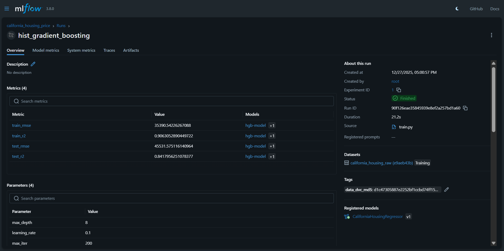
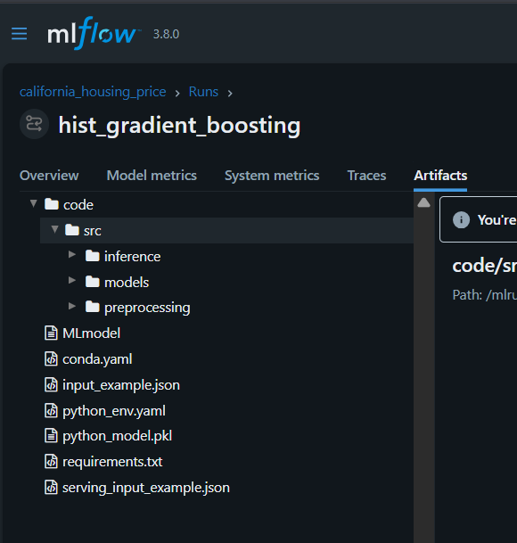

# MLflow Experiment Tracking

This document describes how MLflow is used for **experiment tracking** in this
project.

Experiment tracking provides visibility into:
- Model configurations
- Source code used for training and inference
- Training metrics
- Dataset lineage
- Reproducibility across runs


## 🎯 Purpose of Experiment Tracking

The goals of experiment tracking in this project are:

- Compare multiple training runs
- Reproduce past results
- Understand model performance evolution
- Provide traceability between code, data, and models

MLflow is used as the **central system of record** for all training runs.


## 🧪 Experiments

All training runs are logged under the experiment:

```
california_housing_price
```

Each execution of the training pipeline corresponds to **one MLflow run**.

Runs are created automatically when the training pipeline starts.


## 📌 What Is Logged Per Run

### Parameters

Model hyperparameters are logged, including (but not limited to):

- `max_depth`
- `learning_rate`
- `max_iter`
- `random_state`

These parameters define the model configuration for the run.

---

### Metrics

Both training and evaluation metrics are logged:

- Training metrics (e.g. RMSE, R²)
- Test/validation metrics (e.g. RMSE, R²)

Metrics are logged separately to allow comparison across runs.

---

### Dataset Lineage

Dataset lineage is captured using:

- MLflow dataset logging
- Dataset identifiers (e.g. name)
- DVC hash stored as an MLflow tag

This allows each run to be traced back to the exact dataset version used
during training.



---

### Source Code Snapshot (Important)

In addition to parameters and metrics, the **source code required for inference**
is packaged and logged with the model artifact.

Specifically:

- The entire `src/` directory is included using MLflow’s `code_paths` mechanism
- This ensures that preprocessing, feature engineering, and inference logic
  used during training is preserved with the model

This guarantees that:
- Inference uses the **exact same code** as training
- Model behavior is reproducible across environments
- The model artifact is self-contained and portable

The source code is versioned implicitly as part of the MLflow run and travels
with the registered model.

---

### Artifacts (High-Level)

Each run logs:
- The unified model artifact
- The algorithm-specific model artifact
- Supporting MLflow metadata



## 🔍 Inspecting Runs

Runs can be inspected via the MLflow UI:

```
http://localhost:5000
```

From the UI, users can:
- Compare parameters and metrics
- Inspect logged artifacts
- Trace runs to registered models


## 🧭 Design Principles

- Every training execution is traceable
- Metrics and parameters are first-class entities
- Dataset lineage is explicitly captured

---

